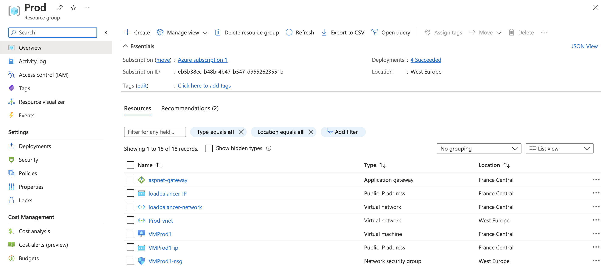
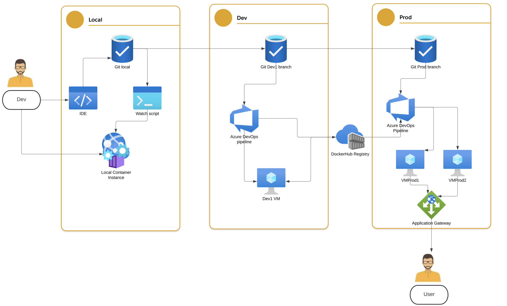

## Env Setup
The basic flow and development cycle follows the GitOps approach, promoting the releases across branches:

```Local -> Dev1 -> Prod```

Consequently, there are two slighlty different Azure DevOps pipelines, listed on the project [aspnet-mssql-Tenable](https://dev.azure.com/samuel1987/aspnet-mssql-Tenable/):
- [Dev1-samuelsouza.awesome-compose](https://github.com/samuelsouza/awesome-compose/blob/dev1/azure-pipelines.yml)
- [Prod-samuelsouza.awesome-compose](https://github.com/samuelsouza/awesome-compose/blob/dev1/azure-pipelines-1.yml)

Respectively, there are 3 Azure agents on 3 Pools: Dev1, VMProd1 and VMProd2. (The agents are currently stopped, because Azure DevOps project is public).

And two environments:
for simplicity, I have generated certs only for prod.
- [http://dev.samuelsouza.com](http://dev.samuelsouza.com)
- [https://prod.samuelsouza.com](https://prod.samuelsouza.com) 

Dev environment is a VM setup on Azure cloud. It is described on this [ARM Template](https://github.com/samuelsouza/awesome-compose/blob/dev1/aspnet-mssql/VM.template.json). VM configuration was supposed to be an ansible script, but for lack of time I only listed the commands on a script-like file, [vmConfiguration.sh](https://github.com/samuelsouza/awesome-compose/blob/dev1/aspnet-mssql/vmConfiguration.sh)

Prod environment, contains 2 VMs (they follow the same template as Dev), but they are behind a Application Gateway ([ARM Tempalte](https://github.com/samuelsouza/awesome-compose/blob/dev1/aspnet-mssql/LB.template.json)), that loadbalances the load between the hosts and add a certain degree of resiliance, allowing near zero down-time deployments.

Prod env is hosting valid certs issued by [Let's encrypt certbot](https://certbot.eff.org/), they are installed directly on the loadbalancer:

```sudo certbot certonly --standalone```

Both envs are configured on subdomains. As fallows:
```
dev.samuelsouza.com.	843	A	20.56.144.109
prod.samuelsouza.com.	843	A	20.111.19.229
```

View from Azure Portal Prod Setup



## CI/CD Process

Local environment is monitoring the project folder for changes with a [script](https://github.com/samuelsouza/awesome-compose/blob/dev1/aspnet-mssql/watch.sh) (for MacOS). Upon changes, it dispaches the rebuild process as described on [compose-local.yaml](https://github.com/samuelsouza/awesome-compose/blob/dev1/aspnet-mssql/compose-local.yaml). The new service version will become available on localhost:80. The script can also start test frameworks, at the moment, we simply check the deployment with a cURL request.

**Start the monitoring script**

```./watch.sh```

Pushing changes to Dev1. Once tested locally, the changes can be integrated to the test environment (Dev1). The pipeline will be triggered upon commit. It will build the image as described on compose-local.yaml and publish the container image to the DockerHub registry, project accessible [here](https://hub.docker.com/repository/docker/samucasouza/test-docker). Pipeline also enriches the environment adding a tool for log aggregation, I used the ready-to-go project [dozzle](https://dozzle.dev/). The UI is mapped to the port 8888, or [Here](http://dev.samuelsouza.com:8888/).

To push the changes to Prod Pull-request is required, prod is a protected branch on github. The pipeline, alongside with the Application Gateway Loadbalancer, acts together to allow a deployment on a near zero-downtime rolling deployment. It calls for [compose.yaml](https://github.com/samuelsouza/awesome-compose/blob/dev1/aspnet-mssql/compose.yaml) twice, once for each VMProd agent, the rolling update alongside with localbalancer realtime health checks, allow the traffic to be redirected to live and most recent instances.

Full CI/CD process:




--- Original Readme
## Compose sample application: ASP.NET with MS SQL server database

Project structure:
```
.
├── app
│   ├── aspnetapp
│   │   ├── appsettings.Development.json
|   |   └── ...
│   ├── ...
│   └── Dockerfile
└── compose.yaml
```

[_compose.yaml_](compose.yaml)
```
services:
  web:
    build: app
    ports:
    - 80:80
  db:
    # mssql server image isn't available for arm64 architecture, so we use azure-sql instead
    image: mcr.microsoft.com/azure-sql-edge:1.0.4
    # If you really want to use MS SQL Server, uncomment the following line
    #image: mcr.microsoft.com/mssql/server
    ...
```
The compose file defines an application with two services `web` and `db`. The image for the web service is built with the Dockerfile inside the `app` directory (build parameter).

When deploying the application, docker compose maps the container port 80 to port 80 of the host as specified in the file.
Make sure port 80 on the host is not being used by another container, otherwise the port should be changed.

> ℹ️ **_INFO_**  
> For compatibility purpose between `AMD64` and `ARM64` architecture, we use Azure SQL Edge as database instead of MS SQL Server.  
> You still can use the MS SQL Server image by uncommenting the following line in the Compose file   
> `#image: mcr.microsoft.com/mssql/server`

## Deploy with docker compose

```
$ docker compose up -d
Creating network "aspnet-mssql_default" with the default driver
Building web
Step 1/13 : FROM mcr.microsoft.com/dotnet/sdk:5.0 AS build
2.1: Pulling from dotnet/core/sdk
....
....
a9dca2f6722a: Pull complete
Digest: sha256:9b700672670bb3db4b212e8aef841ca79eb2fce7d5975a5ce35b7129a9b90ec0
Status: Downloaded newer image for microsoft/mssql-server-linux:latest
Creating aspnet-mssql_web_1 ... done
Creating aspnet-mssql_db_1  ... done
```


## Expected result

Listing containers must show two containers running and the port mapping as below:
```
$ docker ps
CONTAINER ID        IMAGE               COMMAND                  CREATED             STATUS              PORTS                  NAMES
7f3a2a7ea5c0        microsoft/mssql-server-linux   "/opt/mssql/bin/sqls…"   4 minutes ago       Up 4 minutes        1433/tcp             aspnet-mssql_db_1
27342dde8b64        aspnet-mssql_web               "dotnet aspnetapp.dll"   4 minutes ago       Up 4 minutes        0.0.0.0:80->80/tcp   aspnet-mssql_web_1
```

After the application starts, navigate to `http://localhost:80` in your web browser.


Stop and remove the containers

```
$ docker compose down
```
